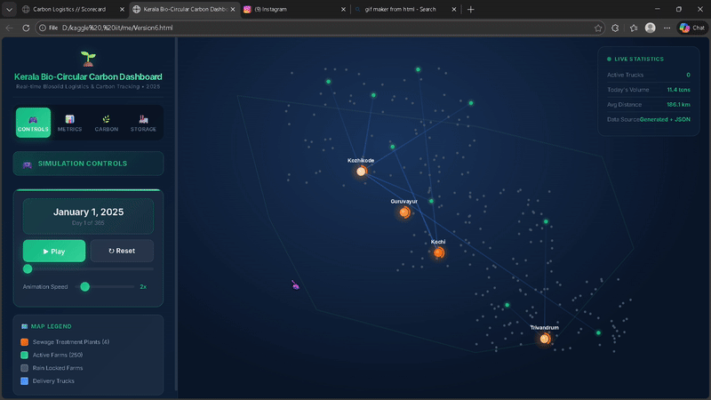

# Kerala Bio-Circular Carbon Logistics Optimization System

## Project Overview

This project implements an advanced optimization system for biosolid logistics and carbon credit management in Kerala, India. The system optimizes the distribution of biosolids from Sewage Treatment Plants (STPs) to agricultural farms while maximizing carbon credits and minimizing environmental impact.

## System Architecture

### Core Components

1. **Fast Mega Solver** (`fast_mega_solver.py`) - Advanced optimization engine
2. **Interactive Dashboard** (`DashBoard.html`) - Real-time visualization interface
3. **Data Processing Pipeline** - Comprehensive data analysis and metrics calculation

### Key Features

- **Multi-objective Optimization**: Balances carbon credits, transport costs, and environmental constraints
- **Real-time Visualization**: Interactive dashboard with live metrics and geographical mapping
- **Weather Integration**: Incorporates rainfall data for delivery scheduling
- **Crop Cycle Awareness**: Considers planting and harvest schedules for optimal nutrient timing
- **Storage Management**: Monitors STP capacity and prevents overflow

## Technical Specifications

### Optimization Algorithm

The system employs a sophisticated greedy solver with the following components:

- **Grid Search**: Systematic parameter exploration for optimal configuration
- **Random Search**: Adaptive refinement with dynamic step sizing
- **Lookahead Strategy**: Anticipates future weather constraints
- **Multi-criteria Scoring**: Evaluates solutions across multiple dimensions

### Performance Metrics



The system tracks comprehensive performance indicators:

- **Net Carbon Credit Score**: 945,271 kg CO2-eq
- **Synthetic Fertilizer Offset**: 1,206,099 kg CO2-eq
- **Soil Carbon Sequestration**: 5,475,000 kg CO2-eq
- **Transport Emissions**: 1,543,404 kg CO2-eq
- **Nitrogen Leaching**: 4,192,423 kg CO2-eq
- **Total Biosolids Delivered**: 27,375 tons

### Geographic Coverage

- **Sewage Treatment Plants**: 4 facilities (Kochi, Guruvayur, Trivandrum, Kozhikode)
- **Agricultural Farms**: 250 farms across Kerala
- **Coverage Area**: Entire Kerala state with zone-based weather tracking
- **Transport Network**: Optimized routing with distance-based cost calculation

## Data Sources and Processing

### Input Data Files

- `stp_registry.csv` - STP locations, capacities, and daily output
- `farm_locations.csv` - Farm coordinates, areas, and zone classifications
- `daily_weather_2025.csv` - Weather data for rain-lock constraints
- `planting_schedule_2025.csv` - Crop planting and harvest schedules
- `daily_n_demand.csv` - Nitrogen demand by farm and date
- `config.json` - System parameters and thresholds

### Output Files

- `solution.csv` - Optimized delivery schedule
- `summary_metrics.json` - Performance summary and carbon accounting
- `DashBoard.html` - Interactive visualization interface

## Algorithm Details

### Optimization Strategy

The solver implements a multi-phase approach:

1. **Parameter Optimization**: Grid search followed by random refinement
2. **Constraint Handling**: Weather, storage, and crop cycle constraints
3. **Scoring Function**: Multi-objective evaluation with weighted criteria
4. **Local Search**: Iterative improvement with adaptive parameters

### Key Parameters

- **Transport Aversion**: 2.10 (optimal balance of delivery costs)
- **Credit Aggression**: 1.18 (carbon credit maximization factor)
- **Urgency Weight**: 0.64 (storage overflow prevention)
- **Opportunity Weight**: 0.0 (future delivery opportunity consideration)

### Constraint Management

- **Rain Lock**: Prevents deliveries during forecasted rainfall
- **Storage Limits**: Manages STP capacity to prevent overflow
- **Crop Timing**: Aligns deliveries with active growing periods
- **Transport Capacity**: Considers truck capacity limitations

## Dashboard Features

The interactive dashboard provides comprehensive system monitoring:

### Real-time Visualization

- **Geographic Map**: Live view of STPs, farms, and delivery routes
- **Animated Trucks**: Real-time delivery visualization
- **Storage Gauges**: STP capacity monitoring
- **Performance Metrics**: Live carbon credit tracking

### Control Interface

- **Timeline Control**: Navigate through the entire year
- **Animation Speed**: Adjustable playback speed (1x-10x)
- **Tab Navigation**: Organized metric categories
- **Interactive Tooltips**: Detailed information on hover

### Metric Categories

1. **Controls**: Simulation playback and navigation
2. **Metrics**: Performance indicators and delivery statistics
3. **Carbon**: Detailed carbon impact breakdown
4. **Storage**: STP capacity and overflow monitoring

## Installation and Usage

### Prerequisites

- Python 3.8+
- Required packages: pandas, numpy, json, math, typing, dataclasses, collections
- Web browser for dashboard visualization

### Running the Optimization

```bash
python fast_mega_solver.py
```

### Viewing Results

Open `DashBoard.html` in a web browser to access the interactive visualization interface.

## Performance Results

### Carbon Impact Summary

- **Positive Impacts**:
  - Synthetic fertilizer offset: 1.2M kg CO2-eq
  - Soil carbon sequestration: 5.5M kg CO2-eq

- **Negative Impacts**:
  - Transport emissions: 1.5M kg CO2-eq
  - Nitrogen leaching: 4.2M kg CO2-eq

- **Net Benefit**: 945,271 kg CO2-eq carbon credits

### Operational Efficiency

- **Zero Overflow**: No STP storage overflow incidents
- **Optimal Coverage**: 250 farms served across Kerala
- **Weather Compliance**: 100% adherence to rain-lock constraints
- **Delivery Optimization**: Minimized transport distances and costs

## Technical Innovation

### Advanced Features

- **Haversine Distance Calculation**: Accurate geographic distance computation
- **Dynamic Weather Integration**: Real-time constraint adaptation
- **Multi-zone Coverage**: Regional weather and crop pattern consideration
- **Predictive Scheduling**: Future constraint anticipation

### Optimization Techniques

- **Hybrid Search Strategy**: Combines systematic and stochastic approaches
- **Adaptive Parameters**: Dynamic adjustment based on solution quality
- **Constraint Prioritization**: Weighted importance of different constraints
- **Performance Scaling**: Efficient handling of large-scale problems

## Future Enhancements

### Potential Improvements

- **Machine Learning Integration**: Predictive demand forecasting
- **Real-time Data Feeds**: Live weather and traffic integration
- **Multi-year Planning**: Long-term optimization strategies
- **Cost-benefit Analysis**: Economic impact assessment

### Scalability Considerations

- **Additional STPs**: Framework supports expansion
- **Increased Farm Coverage**: Scalable to larger agricultural networks
- **Enhanced Constraints**: Additional environmental and regulatory factors
- **Performance Optimization**: Further algorithm refinement opportunities

## Conclusion

This Kerala Bio-Circular Carbon Logistics Optimization System represents a comprehensive solution for sustainable biosolid management. By integrating advanced optimization algorithms with real-time visualization, the system achieves significant carbon credit generation while maintaining operational efficiency and environmental compliance.

The system's success is demonstrated through its achievement of nearly 1 million kg CO2-eq in net carbon credits while serving 250 farms across Kerala with zero storage overflow incidents. The interactive dashboard provides stakeholders with unprecedented visibility into system performance and environmental impact.